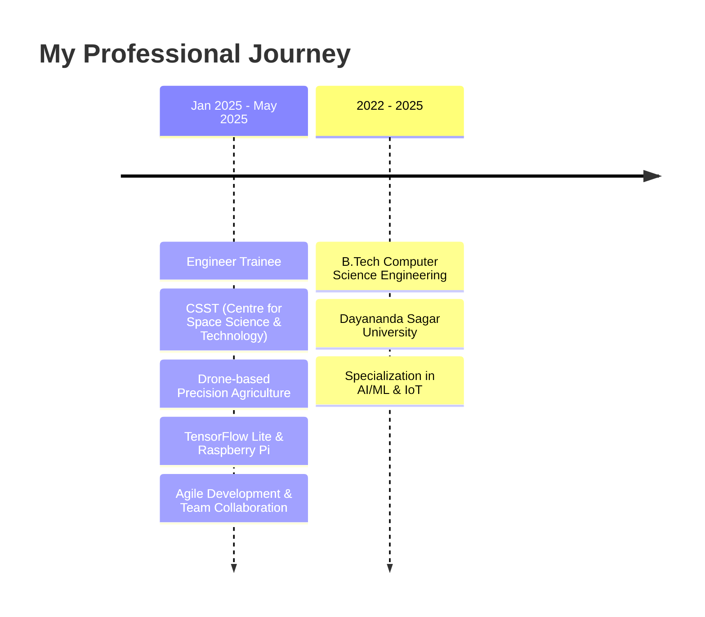

# Hi there, I'm Yashwanth G M! 👋

<div align="center">

[](https://git.io/typing-svg)

</div>

<div align="center">


[](https://www.linkedin.com/in/yash2000yash)
[](https://yashwanthgm.vercel.app/)
[](mailto:gmyashwanth2000@gmail.com)

</div>

## 🚀 About Me

```python
class YashwanthGM:
    def __init__(self):
        self.name = "Yashwanth G M"
        self.role = "Aspiring Python Developer"
        self.location = "Bengaluru, Karnataka, India"
        self.education = "B.Tech CSE @ Dayananda Sagar University"
        self.interests = ["AI/ML", "Drone Technology", "IoT", "Web Development"]
        
    def current_work(self):
        return {
            "position": "Engineer Trainee",
            "company": "CSST (Centre for Space Science & Technology)",
            "duration": "Jan 2025 - May 2025",
            "focus": "Drone-based Precision Agriculture System"
        }
    
    def say_hi(self):
        print("Thanks for dropping by! Let's build something amazing together 🚀")

me = YashwanthGM()
me.say_hi()
```

<div align="center">


</div>

## 🛠️ Tech Stack

<div align="center">

### Languages & Frameworks


### AI/ML & Data Science


### Databases & Cloud


### Tools & Platforms


### Specialized Technologies


</div>

## 📊 GitHub Stats

<div align="center">


</div>

<div align="center">


</div>

## 🎯 Featured Projects

<div align="center">

### 🚁 Smart Crop Monitoring Using Drone Technology
[](https://github.com/yashwanth2000GM/drone-crop-monitoring)

**🏆 IEEE Published Research | Patent Holder | Top 10 Final Year Project**

- 🎯 **95%+ Accuracy** in real-time plant disease detection
- 🤖 **TensorFlow Lite** model optimized for Raspberry Pi
- 📱 **React Native** mobile app for farmers
- 🌐 **IoT Integration** with GPS tracking and smart spraying
- 🔥 **Tech Stack:** Python, TensorFlow Lite, Raspberry Pi, OpenCV, React Native, Flask, MongoDB

---

### 🌿 Plant Disease Detection (Aloe Vera)
[](https://github.com/yashwanth2000GM/aloe-vera-disease-detection)

- 🧠 **CNN Model** for disease prediction
- 🌐 **Flask Web Service** with responsive frontend
- 📊 **Firebase Integration** for data storage
- 📈 **Logging System** for model evaluation
- 🔧 **Tech Stack:** Python, Flask, HTML/CSS/JS, Firebase

---

### 🏨 Hotel Booking System
[](https://github.com/yashwanth2000GM/hotel-booking-system)

- 🔐 **Secure Authentication** system
- 🍽️ **Dynamic Menu** with real-time updates
- 👤 **User Profiles** for reservation management
- ⚡ **REST APIs** for seamless integration
- 🔧 **Tech Stack:** Python (Flask), MySQL, HTML/CSS, REST APIs

</div>

## 💼 Professional Experience

<div align="center">



</div>

## 🏆 Achievements & Certifications

<div align="center">

| 🎓 **Certifications** | 🏆 **Achievements** |
|:---:|:---:|
|  **Certified Application Developer** | 📄 **IEEE Research Paper** Published |
|  **Certified System Administrator** | 🎯 **Patent Holder** - Drone Technology |
|  **Python for Beginners (2023)** | 🥇 **Top 10** out of 200+ teams in Project Exhibition |

</div>

## 🌟 What I'm Currently Working On

<div align="center">

```python
current_focus = {
    "🔬 Research": "Advanced ML models for precision agriculture",
    "🚁 Drone Tech": "Enhanced computer vision for crop monitoring", 
    "📱 Mobile Dev": "React Native apps for farmers",
    "🤖 AI/ML": "Exploring LangChain and LLMs (OpenAI, Hugging Face)",
    "☁️ Cloud": "Scaling IoT solutions with cloud integration"
}

for area, description in current_focus.items():
    print(f"{area}: {description}")
```

</div>

## 📈 Activity Graph

<div align="center">

[](https://github.com/ashutosh00710/github-readme-activity-graph)

</div>

## 🎵 Currently Vibing To

<div align="center">

[](https://spotify-github-profile.vercel.app/api/view?uid=YOUR_SPOTIFY_ID&redirect=true)

</div>

## 🤝 Let's Connect and Build Together!

<div align="center">

> *"Innovation distinguishes between a leader and a follower."* - Steve Jobs

I'm always excited to collaborate on innovative projects, especially in **AI/ML**, **Drone Technology**, and **IoT**. 

Whether you want to discuss cutting-edge tech, explore research opportunities, or just have a chat about the future of technology, I'm all ears! 

**Let's turn ideas into reality! 🚀**

---


⭐️ From [Yashwanth GM](https://github.com/yashwanth2000GM) with ❤️

</div>
